# 📚 ImageLibrary-Qt-OpenCV

##  Contexte Académique
Projet réalisé dans le cadre du **Master 2 SIA2 – Signal, Image et Apprentissage Automatique**  
Université Toulouse III – Paul Sabatier

##  Objectif du Projet
Développer une application **C++ modulaire** permettant :
- La gestion d’une bibliothèque d’images
- Le contrôle d’accès par niveau utilisateur
- L’application d’algorithmes classiques de traitement d’image
- Une interaction via interface graphique Qt

##  Architecture Logicielle
Architecture modulaire avec séparation claire :
- Interface graphique (Qt)
- Backend métier (ImageLibrary)
- Gestion des utilisateurs
- Module traitement d’image (OpenCV)

##  Schéma de l’architecture

 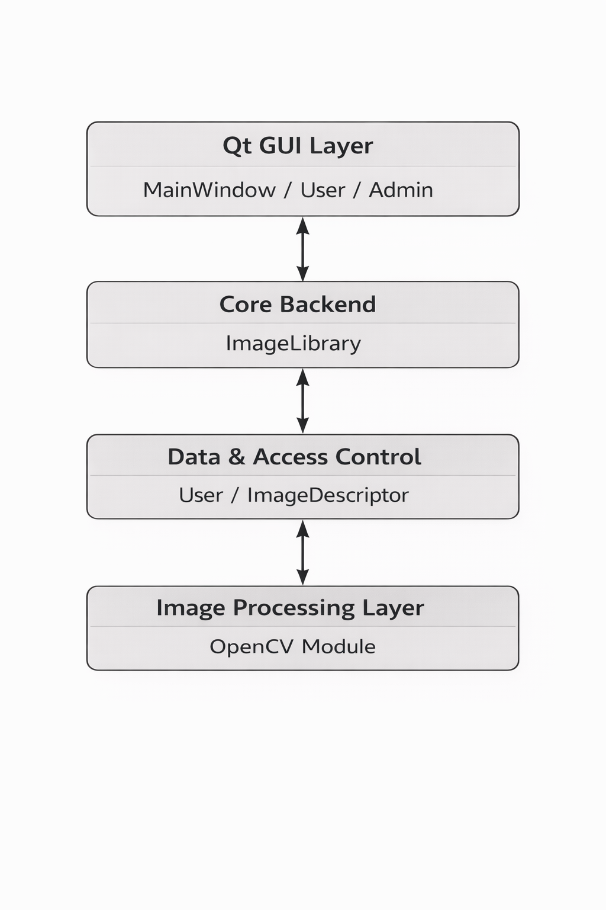 

### Objectifs de l’architecture
- Modularité
- Évolutivité
- Maintenance simplifiée

##  Traitements Implémentés
- Affichage de l’image originale
- Filtrage convolution 3×3
- Détection de contours (gradient)
- Histogramme des niveaux de gris

##  Composants Principaux

###  ImageDescriptor
Représente les métadonnées d’une image :
- Numéro
- Titre
- Chemin source
- Mot-clé
- Coût
- Niveau d’accès

Cette classe constitue l’entité de base de la bibliothèque.

###  ImageLibrary
Cœur du système.

Fonctionnalités :
- Stockage via liste chaînée personnalisée
- Ajout / suppression d’image
- Filtrage par coût
- Filtrage par mot-clé
- Vérification des droits d’accès
- Sauvegarde / chargement depuis un fichier

Cette classe centralise toute la logique métier.

###  User
Représente un utilisateur authentifié.

Niveaux :
- NONE
- LEVEL1 (Consultation)
- LEVEL2 (Administrateur)

Gestion :
- Validation des permissions
- Contrôle des rôles

###  Module d’Authentification
Valide :
- Format du code utilisateur (8 caractères)
- Attribution du niveau d’accès

##  Interface Graphique (Qt)

### Diagramme UML
Architecture générale de l’application :

 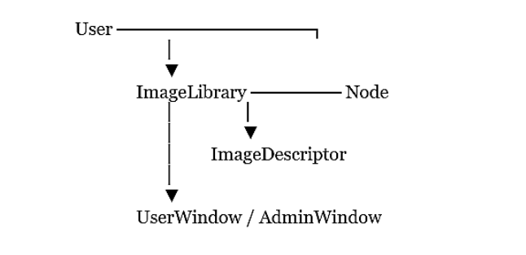 

Diagramme UML généré avec PlantUML :

 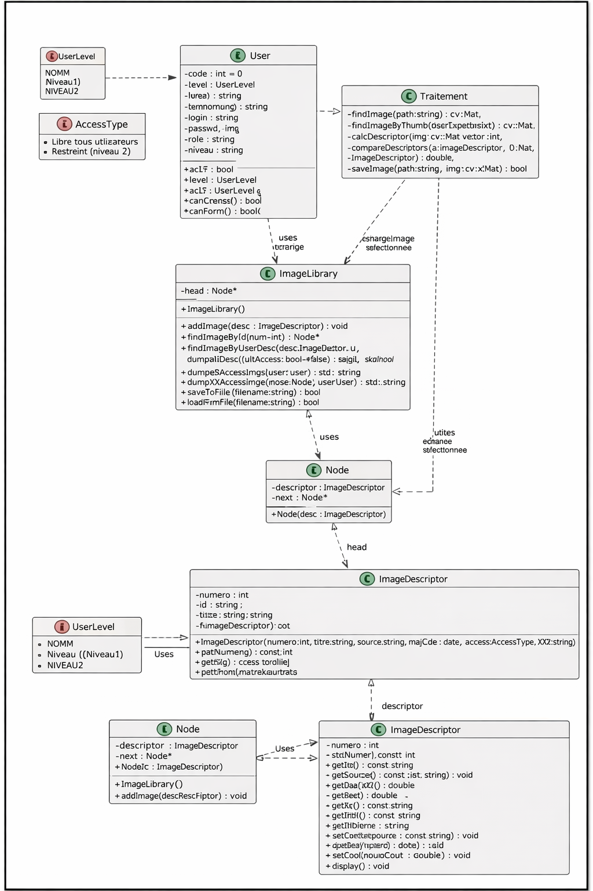 

##  Système d’Authentification
Trois niveaux d’accès :

| Niveau | Rôle            | Droits                  |
|-------:|-----------------|-------------------------|
| 0      | Aucun accès     | Accès refusé            |
| 1      | Utilisateur     | Consultation uniquement |
| 2      | Administrateur  | Accès complet           |

##  Illustration des niveaux

### Niveau 0 – Aucun accès

 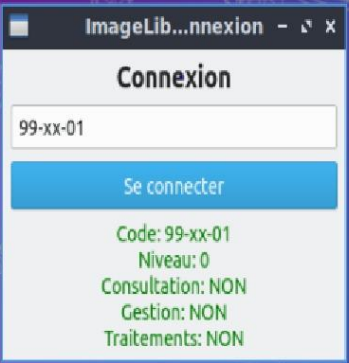 

### Niveau 1 – Consultation

 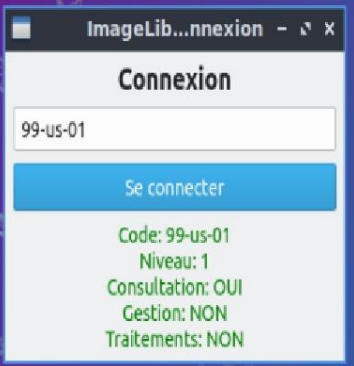 

### Niveau 2 – Administrateur

 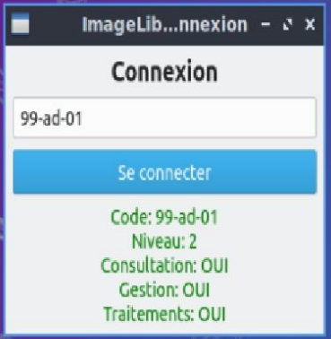 

##  Intégration des interfaces selon les droits utilisateurs
Après authentification, l’interface s’adapte automatiquement au niveau de l’utilisateur.

##  Interface Consultation – Niveau 1
L’interface « Bibliothèque – Consultation » permet :
- Consultation des images
- Affichage des informations
- Aucun accès aux fonctions de gestion

 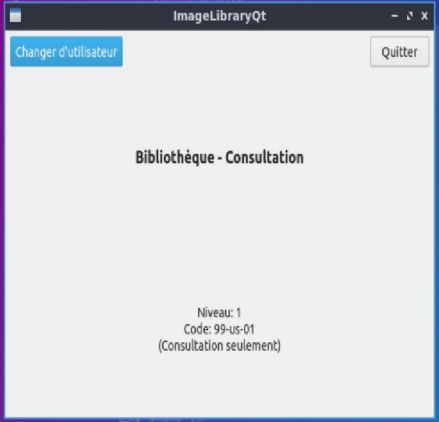 

##  Interface Administrateur – Niveau 2
L’interface « Bibliothèque – Admin » permet :
- Consultation
- Gestion de la bibliothèque
- Application des traitements

  

##  Gestion de la Bibliothèque d’Images

### Mode Administrateur
- Affichage complet des images
- Fiches techniques (numéro, titre, source, mot-clé, coût)
- Ajout de nouvelles images

 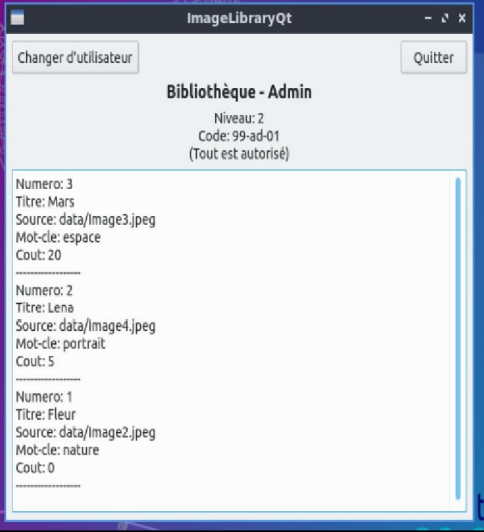 

### Mode Utilisateur Standard
- Consultation uniquement
- Pas d’ajout ni de modification

 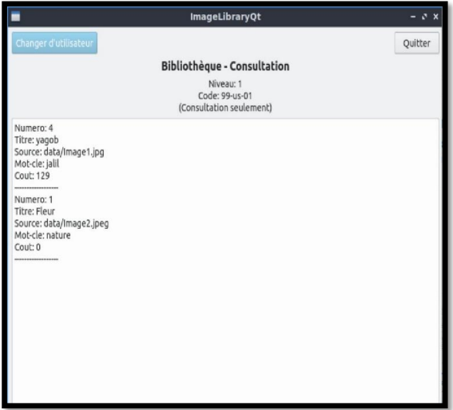 

##  Fonctionnalités Avancées

### Gestion Niveau 2
- Ajout d’image
- Suppression
- Sauvegarde / chargement

 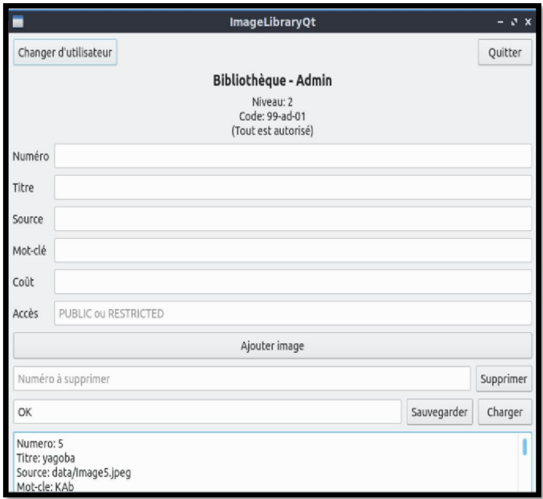 

### Filtrage par Coût – Niveau 1
- Images gratuites
- Intervalle de prix
- Affichage complet

 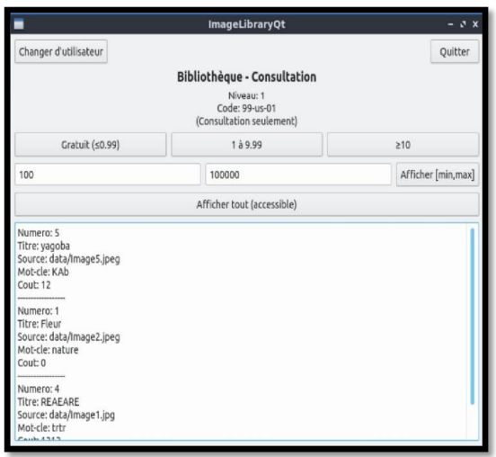 

##  Interface Administrateur – Gestion & Affichage
Ajout / suppression / modification des images via formulaire dédié.  
Affichage complet d’une image sélectionnée.

 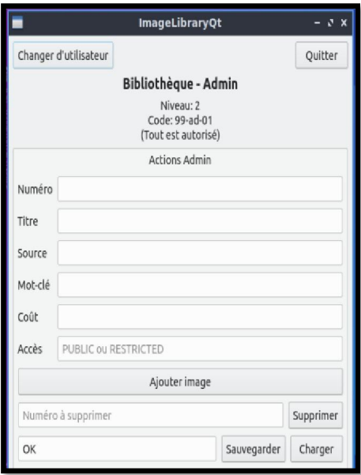 

 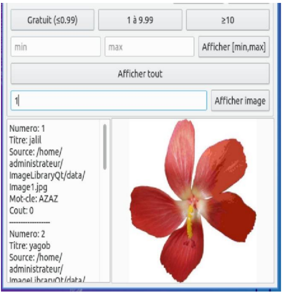 

##  Interface Consultation – Utilisateur Standard
Affichage des images accessibles selon les critères définis.

 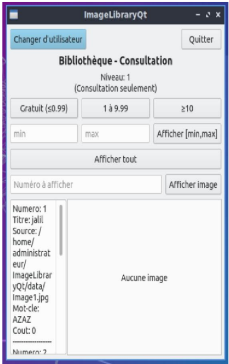 

##  Compilation (Linux)
- Ouvrir le fichier `.pro` dans Qt Creator
- Configurer le kit (Desktop Qt)
- Cliquer sur **Build**
- Exécuter

##  Améliorations Futures
- Intégration d’une base de données (SQLite)
- Recherche intelligente d’images
- Segmentation avancée
- Modernisation de l’interface
- Optimisation des performances
- Intégration de tests unitaires
